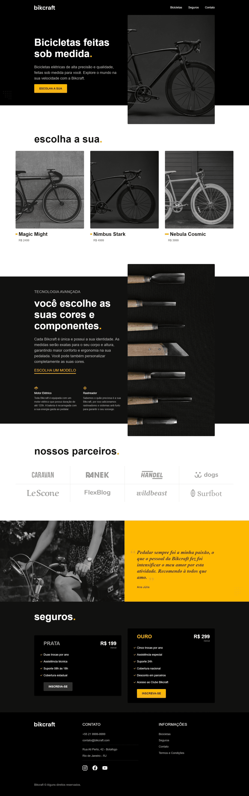

# 💻 Bikcraft

## 📃 About The Project/Sobre o projeto

- A Bikcraft uma empresa que vende bicicletas personalizadas feitas sob medida.
- É um site responsivo, adaptável para smartphones e tablets, em que o JavaScript usado no front end foi o responsável por trazer algumas funcionalidades, como slides navegáveis, por exemplo.

## 🛠️ Tools/Ferramentas

- HTML5
- CSS3
- JavaScript

